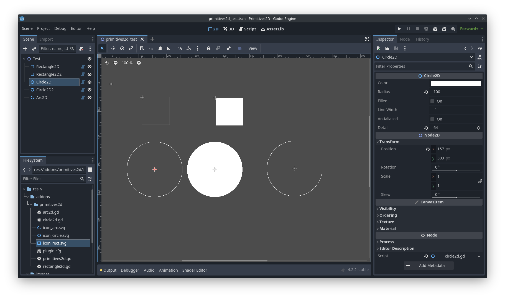

# Primitives2D

  

A plugin for the Godot game engine (version 4.x) for rendering primitive 2d shapes.

While the [`CanvasItem`](https://docs.godotengine.org/en/stable/classes/class_canvasitem.html) class supports a number of methods for rendering primitive shapes, the engine only offers the [Line2D](https://docs.godotengine.org/en/stable/classes/class_line2d.html) and [Polygon2D](https://docs.godotengine.org/en/stable/classes/class_polygon2d.html) nodes for adding primitive shapes to a scene. This plugin introduces the following node types in a similar fashion:
*  [Rectangle2D](#rectangle2d)
*  [Circle2D](#circle2d)
*  [Arc2D](#arc2d)

The nodes simply use the builtin [`CanvasItem`](https://docs.godotengine.org/en/stable/classes/class_canvasitem.html) methods for drawing primitive shapes: [`draw_rect`](https://docs.godotengine.org/en/stable/classes/class_canvasitem.html#class-canvasitem-method-draw-rect), [`draw_circle`](https://docs.godotengine.org/en/stable/classes/class_canvasitem.html#class-canvasitem-method-draw-circle) and [`draw_arc`](https://docs.godotengine.org/en/stable/classes/class_canvasitem.html#class-canvasitem-method-draw-arc).

## Installation

1. Create an `addons` directory inside your project directory.
2. Get the plugin from the AssetLib or from GitHub
    * From the AssetLib: Open the AssetLib from the Godot editor and search for "Primitives2D". Click download to install the plugin.
    * From GitHub: Run `git clone https://github.com/peter-kish/primitives2d.git` and copy the contents of the `addons` directory to your projects `addons` directory.
4. Enable the plugin in `Project Settings > Plugins`.

## Usage

Add a [Rectangle2D](#rectangle2d), [Circle2D](#circle2d) or [Arc2D](#arc2d) node to your scene and set the node properties described below.

### Rectangle2D

Draws a 2D rectangle.

#### Properties

* `color: Color` - The color of the rectangle.
* `size: Vector2` - The size of the rectangle.
* `filled: bool` - If `false`, the rectangle will be drawn as a stroke with the `color` and `line_width` specified.
* `line_width: float` - Width of the stroke (in case `filled` is `true`).
* `centered: bool` - If `true`, the rectangle will be drawn centered.

### Circle2D

Draws a 2D circle.

#### Properties

* `color: Color` - The color of the circle.
* `radius: float` - The radius of the circle.
* `filled: bool` - If `false`, the circle will be drawn as a stroke with the `color` and `line_width` specified.
* `line_width: float` - Width of the stroke (in case `filled` is `true`).
* `antialiased: bool` - If `true`, the lines will attempt to perform antialiasing using OpenGL line smoothing.
* `detail: int` - The number of line segments.

### Arc2D

Draws a unfilled 2D arc.

#### Properties

* `color: Color` - The color of the arc.
* `radius: float` - The radius of the arc.
* `filled: bool` - If `false`, the arc will be drawn as a stroke with the `color` and `line_width` specified.
* `line_width: float` - Width of the stroke (in case `filled` is `true`).
* `antialiased: bool` - If `true`, the lines will attempt to perform antialiasing using OpenGL line smoothing.
* `detail: int` - The number of line segments.